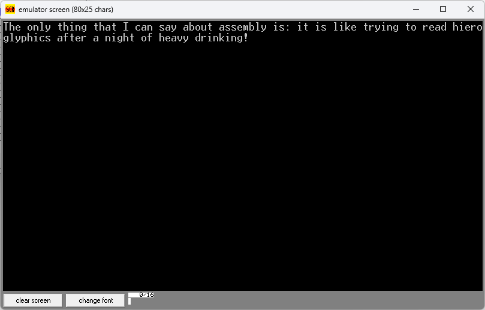

# Assembly fans

This repository is for those who are very interested in assebmly and want to show their devotion and close relationship with it by writing a few sentences about it.

## colaboration:
To participate in this action, it is enough to place the desired text in this part of the code and the asm file in the `src` directory ,put the photo of the output of the program in the `shots` directory then put it in the [readme](README.md) file.
```assembly
.MODEL SMALL  
.STACK 100H  
.DATA  
  
;The string to be printed  
STRING DB 'Put your text here', '$'
  
.CODE  
MAIN PROC FAR  
 MOV AX,@DATA  
 MOV DS,AX  
  
 ; load address of the string  
 LEA DX,STRING  
  
 ;output the string 
 ;loaded in dx  
 MOV AH,09H 
 INT 21H  
  
 ;interrupt to exit
 MOV AH,4CH 
 INT 21H  
  
MAIN ENDP  
END MAIN
```


## Shots:

